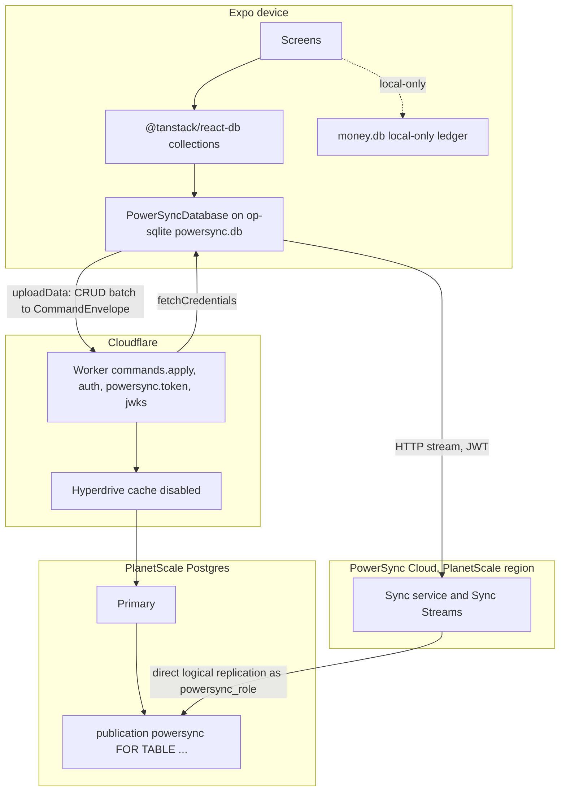

# PowerSync PlanetScale migration plan

This program replaces the custom `sync.getDelta` poll and the Rocicorp Zero proposal with PowerSync. The ledger of record moves to PlanetScale Postgres. Workers reach it through a cache-disabled Hyperdrive binding for `commands.apply` and auth. PowerSync Cloud replicates from PlanetScale over a direct connection and streams rows to Expo through `@powersync/react-native` on `@op-engineering/op-sqlite`. Screens read `@tanstack/react-db` collections built with `@tanstack/powersync-db-collection`. Every money write is still one `commands.apply` call. The PowerSync connector's `uploadData` turns each CRUD batch back into the `CommandEnvelope` it carried in collection metadata. Row-level last-writer-wins is never money authority. Solo local-only installs never call `connect()`. PR order is Z0, Z1, Z2, Z3, Z4, Z5, Z6.

## How to read this

One box is one unit of work. Every box names the evidence that checks it. A nested box is a sub-step of the box above it. Check a box only when its evidence exists, a file, a log line, a screenshot, a test run, or a SHA. The body is a how-to. The appendices explain and record.

The program runs `pstack/skills/poteto-mode/playbooks/autopilot-stack.md`. The operator lands every PR herself. Owners stop at STACK-READY. The root appends a verified chain. No owner merges. Z0, Z1, Z4, Z5, and Z6 are the operator's review-gated items and stop at merge-ready until she reviews them in chat. Z2 and Z3 are not review-gated.

Tests alone are not sufficient verification. A PR is verified only when its unit, live, and perf boxes are all checked.

## Program checklist

### Arm the program

- [ ] State the protocol and this plan to the operator, then stop. Start execution only on her explicit go.
- [ ] On her go, arm a `/goal` with this exact text. "`docs/architecture/powersync-planetscale-migration-plan.md`. PRs Z0 then Z1 then Z2 then Z3 then Z4 then Z5 then Z6. A PR is verified only when its unit, live, and perf boxes are all checked. The operator lands the stack. Done when synced reads flow through PowerSync collections on op-sqlite, Workers write through a cache-disabled Hyperdrive binding to PlanetScale Postgres, every money write is still one `commands.apply` call, `sync.getDelta` and `outbox_commands` are gone from `apps/mobile`, D1 holds no money tables, and #98 is closed with the certification packet."
- [ ] Read these from trunk at program start. Re-read them at every tick.
  - [ ] `git show origin/main:docs/architecture/powersync-planetscale-migration-plan.md`
  - [ ] `git show origin/main:.cursor/skills/verify-trove/SKILL.md`
  - [ ] `git show origin/main:.cursor/skills/verify-trove/features/README.md`
  - [ ] `pstack/skills/poteto-mode/playbooks/autopilot-stack.md` from the pstack checkout the root runs. pstack is not vendored in this repo.
  - [ ] `pstack/skills/swarm/SKILL.md` from the same checkout.
  - [ ] `pstack/skills/poteto-mode/playbooks/opening-a-pr.md` from the same checkout.
  - [ ] `pstack/skills/show-me-your-work/SKILL.md` and `pstack/skills/how/SKILL.md` from the same checkout.
- [ ] Arm the 30-minute audit tick. In a local session, a real terminal `/loop`. In a cloud root, a cloud-sleeper wake chain. Never leave the cadence to memory.
- [ ] Use this tick prompt, verbatim. "Re-read the execution playbook from trunk and the armed /goal. Audit the operation against both and fix drift in this tick. Probe every active lane and judge progress by side effects only. Stand down a stuck lane and dispatch its replacement now. Then send the operator a status message, whether or not anything changed, with the queue table of PR, owner, state, and head SHA, the verdicts since the last tick, what merged, open operator gates, and blockers."
- [ ] On the operator's hold or stand-down, send every owner a zero-writes order at once.

### Spawn owners

- [ ] Spawn one owner per PR with the full lifecycle the execution playbook names.
- [ ] Follow this dependency graph. Start dependent work only after its parent merges, or base it on the parent branch when the execution playbook stacks.
  - [ ] Z0 is first. It branches from `main` and is the only PR that targets `main`.
  - [ ] Z1 after Z0. Z1 does not read Z0's code, but the stack is one linear chain, so Z1 bases on the Z0 branch.
  - [ ] Z2 after Z1.
  - [ ] Z3 after Z2. Z3 needs the Postgres tables, the `powersync_role`, and the `powersync` publication that Z2 migrates.
  - [ ] Z4 after Z3. Z4 needs a live PowerSync instance and the token route.
  - [ ] Z5 after Z4.
  - [ ] Z6 after Z5.
- [ ] Hold the file boundaries.
  - [ ] Z0 touches only `artifacts/powersync-planetscale-spike/**`.
  - [ ] Z1 touches only `apps/mobile/db/**`, `apps/mobile/app/_layout.tsx`, `apps/mobile/package.json`, `apps/mobile/app.config.ts`, `apps/mobile/tests/test-utils/sqlite.ts`, root `package.json`, and the lockfile.
  - [ ] Z2 touches only `packages/db/**`, `packages/api/**`, `packages/auth/**`, `packages/env/**`, `packages/infra/**`, `apps/server/**`, and `docs/architecture/**`.
  - [ ] Z3 touches only `packages/powersync/**`, `packages/api/src/routers/**`, `packages/api/src/lib/powersync/**`, `packages/env/**`, `packages/infra/**`, `apps/server/src/index.ts`, and `deploy/powersync/**`.
  - [ ] Z4 touches only `apps/mobile/modules/powersync/**`, `apps/mobile/modules/ledger-db/**`, `apps/mobile/modules/ledger-data-source/**`, `apps/mobile/hooks/use-sync-worker.ts`, `apps/mobile/hooks/use-rejected-changes.ts`, `apps/mobile/components/rejected-changes/**`, `apps/mobile/lib/migration/**`, `apps/mobile/metro.config.js`, and `apps/mobile/package.json`.
  - [ ] Z5 deletes under `apps/mobile/lib/sync/**`, `apps/mobile/hooks/use-household-push.*`, `apps/mobile/modules/ledger-data-source/**`, `packages/api/src/lib/sync/**`, and `packages/api/src/routers/sync.ts`. It edits `apps/mobile/db/schema.ts`, `apps/mobile/hooks/use-sync-worker.ts`, `CONTEXT.md`, `tools/oxlint/ledger-boundary/allowlist.ts`, `docs/architecture/sqlite-roles.md`, and `docs/postman/**`.
  - [ ] Z6 touches only `packages/powersync/**`, `packages/db/src/migrations/**`, `apps/mobile/modules/powersync/schema.ts`, `apps/mobile/modules/recurring-rules/**`, `apps/mobile/modules/budgeting/**`, `tools/oxlint/ledger-boundary/allowlist.ts`, `packages/infra/**`, `artifacts/powersync-planetscale/**`, and `docs/architecture/**`.
- [ ] Hold the review gate. Z0, Z1, Z4, Z5, and Z6 change an interaction or a one-way stack choice. They wait for the operator's review in chat with screenshots and a video before append.

### PR mechanics, for every PR

- [ ] Resolve the forge once. Default to `gh`; if `command -v origin` succeeds and Origin can resolve the repository, use `origin pr` for every PR operation. Record any fallback to `gh`. Never require `gt`.
- [ ] Open the PR ready, never draft, with `origin pr create --status open --base <base-branch>` or `gh pr create --base <base-branch>` according to the resolved forge. A stack child targets its parent branch.
- [ ] Run the repo's lint and typecheck once before the PR-facing push. `pnpm lint:fix && pnpm format && npx tsc --noEmit`. Push with hooks on.
- [ ] Run `/deslop` before each commit and `/no-comments` before review.
- [ ] Triage every Bugbot and security-reviewer comment per `../references/bugbot-triage.md`.
- [ ] Rebase onto current trunk before babysit and again before the merge-ready report.

### Verdict and merge, for every PR

- [ ] At the merge-ready head SHA, run the swarm per `pstack/skills/swarm/SKILL.md`. One gates lane. The ten live lanes from the PR's **Verify, live** block. The perf lane from its **Verify, perf** block. One audit lane that reads the diff and the receipts and distrusts the PR body.
- [ ] Clean only when every lane is `PASS`. Findings go back to the owner. A new head gets a fresh swarm and a fresh verdict.
- [ ] The root appends the PR to the one linear base-branch stack on a clean verdict. Nobody merges. The operator lands bottom-up. On every rebase, compare `git patch-id` for the base-to-head diff against the verdict SHA per `playbooks/shipping.md`. A changed patch-id goes back through the swarm.

### Boot recipe, for every live lane

Each live lane runs on its own cloud VM at the PR head. Drive the app through `.cursor/skills/verify-trove/SKILL.md` and the Argent device tools it names. Drive the Worker and the databases through `wrangler`, `pscale`, `psql`, and the `powersync` CLI.

- [ ] `git fetch origin <head-branch> && git checkout <head SHA>`.
- [ ] `pnpm install`. For lanes that drive the app, run `.cursor/skills/verify-trove/scripts/launch.sh` with `VERIFY_TROVE_FORCE_BUILD=1` on Z1 and later, then `.cursor/skills/verify-trove/scripts/doctor.sh` until it passes. Expo Go is forbidden after Z1. For lanes that drive the server, run `pnpm --filter @trove/infra alchemy dev` against the lane's PlanetScale branch and wait for `http://127.0.0.1:3000/` to answer.
- [ ] Deliver app input only through Argent (`gesture-tap`, `type-text`, `open-url`, `describe`, `screenshot`). Read-only diagnostics are `doctor.sh`, Metro `/status`, Argent `describe`, `wrangler tail`, `psql`, and the PowerSync dashboard diagnostics page. Never write to `ps_crud`, `ps_oplog`, or the ledger tables by hand.
- [ ] Save every screenshot to `/tmp/swarm-<pr-id>/worker-<n>/<slug>.png` and return the paths with the report.

## Prove PlanetScale Postgres, Hyperdrive, and a PowerSync connection (Z0)

**Depends on.** None.

**Files.**

- [ ] Create `artifacts/powersync-planetscale-spike/README.md`.
- [ ] Create `artifacts/powersync-planetscale-spike/smoke.sh`.
- [ ] Create `artifacts/powersync-planetscale-spike/spike.sql`.
- [ ] Create `artifacts/powersync-planetscale-spike/sync-streams.yaml`.
- [ ] Create `artifacts/powersync-planetscale-spike/verdict.md`.
- [ ] Do not edit `apps/`, `packages/`, or `tools/`.

**Build.**

- [ ] Confirm the operator database is PlanetScale Postgres. Run `pscale database show <db> --org <org>` and record `engine: postgresql` in `verdict.md`. A Vitess MySQL answer stops the program.
- [ ] Connect to the PlanetScale branch with `psql` on the direct `:5432` connection string. Run `SHOW wal_level` and record `logical`.
- [ ] Run `spike.sql`. It creates a spike schema with `accounts`, `categories`, `transactions`, and `membership` tables that carry a `text` primary key named `id`. It creates `powersync_role WITH REPLICATION BYPASSRLS LOGIN`, grants `SELECT` on the four tables, and runs `CREATE PUBLICATION powersync FOR TABLE public.accounts, public.categories, public.transactions, public.membership`. PlanetScale rejects `FOR ALL TABLES`. Record the accepted statement.
- [ ] Create one Hyperdrive config with `wrangler hyperdrive create trove-ledger-fresh --connection-string <pooled or direct PlanetScale URL> --caching-disabled`. Record the id.
- [ ] Deploy a throwaway Worker from `smoke.sh` that runs `SELECT 1` and `INSERT INTO transactions ... RETURNING id` through the binding with the `postgres` driver. Record both results.
- [ ] Create a PowerSync Cloud instance in the region nearest the PlanetScale branch. Connect it to the direct PlanetScale connection string as `powersync_role`, never to the Hyperdrive host. Deploy `sync-streams.yaml` with `config: edition: 3` and one stream `spike_transactions` filtered by `auth.user_id()` through `membership`. Record the instance URL and the replication status the dashboard shows.
- [ ] Mint a development token in the dashboard. Run `smoke.sh` against the instance with the PowerSync Node SDK, insert one row through the Worker, and record the time until the row arrives in the local SQLite file.
- [ ] Write `verdict.md` with pass or fail per step and the winner path. Delete the spike Worker, the Hyperdrive config, and the spike schema after the verdict, and record each deletion.

**You see.**

- [ ] `artifacts/powersync-planetscale-spike/verdict.md` states `engine: postgresql`, `wal_level=logical`, the accepted `CREATE PUBLICATION powersync FOR TABLE ...` statement, the Hyperdrive id with caching disabled, the PowerSync instance URL with replication `active`, and one Worker insert visible in the client SQLite file with its measured delay.

**Verify, unit.** Tests alone are not sufficient verification. A PR is verified only when its unit, live, and perf boxes are all checked.

- [ ] `artifacts/powersync-planetscale-spike/smoke.sh` exits 0 after `SHOW wal_level`, the Hyperdrive `SELECT 1`, the publication check `SELECT pubname FROM pg_publication WHERE pubname = 'powersync'`, and one row round trip into the PowerSync client file. Run `bash artifacts/powersync-planetscale-spike/smoke.sh`.

**Verify, live.** Tests alone are not sufficient verification. A PR is verified only when its unit, live, and perf boxes are all checked. Ten lanes on `grok-4.6-fast-xhigh` at the PR head, per the boot recipe.

- [ ] Lane 1. Regression lane against trunk. Launch the app at trunk and at head and finish onboarding on each. Trunk lacks PlanetScale, Hyperdrive, and PowerSync, so record that and gate the head's unchanged local ledger plus the spike verdict file. Save `z0-regression.png`. Pass when Home renders on both and `verdict.md` exists on head.
- [ ] Lane 2. `pscale database show` engine check. Save `z0-engine.png`. Pass when the output shows `postgresql`.
- [ ] Lane 3. Direct `SHOW wal_level`. Save `z0-wal.png`. Pass when the output is `logical`.
- [ ] Lane 4. Publication created with an explicit table list. Save `z0-publication.png`. Pass when `\dRp+ powersync` lists the four spike tables and `FOR ALL TABLES` is recorded as rejected.
- [ ] Lane 5. Hyperdrive `SELECT 1` and one insert from the spike Worker. Save `z0-hyperdrive.png`. Pass when `wrangler tail` shows both rows and the config JSON shows `"disabled": true` under caching.
- [ ] Lane 6. PowerSync source connection is direct. Save `z0-direct.png`. Pass when the instance connection host is the PlanetScale host and not `*.hyperdrive.local` or any Hyperdrive host.
- [ ] Lane 7. PowerSync replication status. Save `z0-replication.png`. Pass when the dashboard diagnostics show the `powersync` publication and a replication slot in state `active`.
- [ ] Lane 8. `pscale` auth in the lane VM. Save `z0-pscale-auth.png`. Pass when `pscale org list` succeeds with a service token.
- [ ] Lane 9. Row round trip. Insert through the Worker, read from the PowerSync client SQLite file. Save `z0-roundtrip.png`. Pass when the same `id` appears in both and the measured delay is recorded.
- [ ] Lane 10. Spike teardown. Save `z0-teardown.png`. Pass when `wrangler hyperdrive list` no longer lists `trove-ledger-fresh` and `psql` shows no `spike` schema, with each deletion logged in `verdict.md`.

**Verify, perf.** Tests alone are not sufficient verification. A PR is verified only when its unit, live, and perf boxes are all checked.

- [ ] Metric. Trunk has no Postgres path, so the metric is the diff-added work only. `SELECT 1` p90 through Hyperdrive from the Worker, `SELECT 1` p90 direct from the same region, and Worker insert to client SQLite visible p90.
- [ ] Probe. `smoke.sh --bench` runs twenty `SELECT 1` on each path interleaved, then twenty inserts with the client watching the row, and prints p50 and p90 for each. Run it at head. Trunk cannot produce this metric and the lane records that.
- [ ] Baseline. Record the direct `SELECT 1` p90 first as the floor.
- [ ] Rule. Hyperdrive `SELECT 1` p90 under 50 ms from a Worker placed in the PlanetScale region. Insert to client visible p90 under 3 s. A miss on either is recorded in `verdict.md` with the number, and the operator decides at the review gate.

**Review gate.** The operator reviews before merge.

- [ ] Copy lane 7 and lane 9 screenshots into `artifacts/powersync-planetscale-spike/Z0-review-replication.png` and `artifacts/powersync-planetscale-spike/Z0-review-roundtrip.png`.
- [ ] Record a 30 to 60 second video of the `pscale` engine check, the Hyperdrive insert, and the row arriving in the client file. Save it as `artifacts/powersync-planetscale-spike/Z0-review.mp4`.
- [ ] Post the screenshots, the video, and `verdict.md` in chat. Stop at merge-ready. Wait for the operator's click.

**Merge.**

- [ ] Root's clean verdict at the exact head SHA.
- [ ] Bugbot triage done.
- [ ] Rebased onto current trunk after the verdict, patch-id unchanged.
- [ ] Root appends Z0 to the stack. The operator lands it.

## Move Expo SQLite to op-sqlite (Z1)

**Depends on.** Z0.

**Files.**

- [ ] Edit `apps/mobile/package.json`. Add `@op-engineering/op-sqlite` at 1.17 or later. Remove `expo-sqlite`.
- [ ] Edit root `package.json`. Add the `op-sqlite` config block the pod reads, with `iosSqlite` off so PowerSync can load its extension later.
- [ ] Edit `apps/mobile/app.config.ts`. Drop the `expo-sqlite` plugin. Set `expo-updates` to use the third-party SQLite pod.
- [ ] Edit `apps/mobile/db/client.ts`. Replace `useSQLiteContext` and `drizzle-orm/expo-sqlite` with an `open({ name: DB_NAME })` handle and `drizzle-orm/op-sqlite`.
- [ ] Edit `apps/mobile/db/initialize.ts`, `apps/mobile/db/migrate.ts`, and `apps/mobile/db/reset.ts` to take the op-sqlite handle.
- [ ] Edit `apps/mobile/app/_layout.tsx`. Replace `SQLiteProvider` with a provider that opens `money.db` once and runs `initializeDatabase`.
- [ ] Edit `apps/mobile/tests/test-utils/sqlite.ts` and the Jest mocks that name `expo-sqlite`.
- [ ] Run `npx expo prebuild --clean` on a lane VM. Commit no `ios/` or `android/` output. The repo stays on continuous native generation.

**Build.**

- [ ] Open `money.db` through op-sqlite. Keep the drizzle schema in `apps/mobile/db/schema.ts` and the migration files unchanged. Keep `initializeDatabase`, `resetDatabase`, and the seed path working. Dev builds only. Prove that a fresh install, a create, a relaunch, and Erase All Data behave the same as on trunk. Nothing PowerSync lands here. This PR exists so Z4 can add `@powersync/react-native` without a second SQLite library in the binary.

**You see.**

- [ ] A fresh install finishes onboarding and lists the account. `rg "expo-sqlite" apps/mobile --glob '!node_modules'` returns only the lockfile or nothing.

**Verify, unit.** Tests alone are not sufficient verification. A PR is verified only when its unit, live, and perf boxes are all checked.

- [ ] `apps/mobile/db/initialize.test.ts`, `apps/mobile/db/reset.test.ts`, and the migration tests pass against the op-sqlite mock. Run `pnpm test apps/mobile/db`.

**Verify, live.** Tests alone are not sufficient verification. A PR is verified only when its unit, live, and perf boxes are all checked. Ten lanes on `grok-4.6-fast-xhigh` at the PR head, per the boot recipe.

- [ ] Lane 1. Regression lane against trunk. Finish onboarding and create one account on trunk and on head. Save `z1-regression-account.png`. Pass when both Home screens list the account and the head binary is a dev client built with op-sqlite.
- [ ] Lane 2. Cold launch after a clean prebuild. Save `z1-launch.png`. Pass when Home renders with no native module error in Metro.
- [ ] Lane 3. Create a category and a transaction. Save `z1-txn.png`. Pass when Ledger lists the transaction.
- [ ] Lane 4. Create a recurring rule on the local path. Save `z1-recurring.png`. Pass when Recurring Rules lists it.
- [ ] Lane 5. Open Envelopes on the local path. Save `z1-envelopes.png`. Pass when Envelopes renders its local setup or list state.
- [ ] Lane 6. Relaunch the app. Save `z1-relaunch.png`. Pass when the transaction from lane 3 is still listed.
- [ ] Lane 7. Erase All Data then finish onboarding again. Save `z1-erase.png`. Pass when the erase completes and a new account can be created.
- [ ] Lane 8. Third-party SQLite pod flag. Save `z1-updates-flag.png`. Pass when the generated `ios/Podfile.properties.json` shows the `expo-updates` third-party SQLite setting on.
- [ ] Lane 9. No duplicate SQLite symbols. Save `z1-pods.png`. Pass when the `pod install` and Xcode link logs contain no duplicate `sqlite3` symbol warnings.
- [ ] Lane 10. Android smoke when the lane VM has an emulator. Save `z1-android.png`. Pass when the app launches to Home, or the lane records the skip with the reason.

**Verify, perf.** Tests alone are not sufficient verification. A PR is verified only when its unit, live, and perf boxes are all checked.

- [ ] Metric. Cold launch to Home, and time to insert 100 local transactions through `db/seed.ts`.
- [ ] Probe. Interleave five runs each of trunk on expo-sqlite and head on op-sqlite on the same simulator. Read the launch time from Metro's first render log and the insert time from a `console.time` around the seed call.
- [ ] Baseline. Record the trunk medians first.
- [ ] Rule. Head cold launch within 15 percent of trunk. Head 100-row insert median at or under trunk.

**Review gate.** The operator reviews before merge.

- [ ] Copy lane 1 and lane 6 screenshots into `artifacts/powersync-planetscale/Z1-review-account.png` and `artifacts/powersync-planetscale/Z1-review-relaunch.png`.
- [ ] Record a 30 to 60 second video of launch, create, relaunch, and Erase All Data. Save it as `artifacts/powersync-planetscale/Z1-review.mp4`.
- [ ] Post the screenshots and the video in chat. Stop at merge-ready. Wait for the operator's click.

**Merge.**

- [ ] Root's clean verdict at the exact head SHA.
- [ ] Bugbot triage done.
- [ ] Rebased onto current trunk after the verdict, patch-id unchanged.
- [ ] Root appends Z1 to the stack. The operator lands it.

## Port the ledger to PlanetScale Postgres through Hyperdrive (Z2)

**Depends on.** Z1.

**Files.**

- [ ] Edit `packages/db/src/schema/*.ts` from `drizzle-orm/sqlite-core` to `drizzle-orm/pg-core`. Keep every table name lowercase snake case and every primary key a `text` column named `id`.
- [ ] Edit `packages/db/src/index.ts`. Replace `drizzle-orm/d1` with `drizzle-orm/postgres-js` over `env.HYPERDRIVE_FRESH.connectionString`.
- [ ] Create `packages/db/src/migrations/0007_postgres_baseline.sql` from `drizzle-kit generate` with the `postgresql` dialect. Append `CREATE ROLE powersync_role WITH REPLICATION BYPASSRLS LOGIN`, the `GRANT SELECT` list, and `CREATE PUBLICATION powersync FOR TABLE public.membership, public.accounts, public.categories, public.transactions`. Never `FOR ALL TABLES`.
- [ ] Edit `packages/infra/alchemy.run.ts`. Replace `Cloudflare.D1.Database("database")` with `Cloudflare.Hyperdrive("HYPERDRIVE_FRESH", { caching: { disabled: true } })` bound to the PlanetScale pooled connection string, and pin Worker placement to the PlanetScale region.
- [ ] Edit `packages/env/src/server.ts`. Replace `DB` with `HYPERDRIVE_FRESH`.
- [ ] Edit `packages/api/src/lib/commands/pipeline.ts`, `statements.ts`, and `packages/api/src/lib/commands/import-bundle.ts`. Remove the D1 `batch()` path and its 100-bind chunking. Use one `db.transaction` per command with `pg_advisory_xact_lock(hashtext(householdId))` where the pipeline serialized before.
- [ ] Edit `packages/api/src/lib/recurring/d1-store.ts`. Rename to `pg-store.ts`. Replace `unixepoch`, `GLOB`, and `json_each` with Postgres equivalents.
- [x] Auth uses WorkOS JWT verification in `packages/auth` (Better Auth removed in #231).
- [ ] Edit `packages/api/**/*.test.ts` from libsql memory to `pglite` or a Postgres testcontainer. One helper in `packages/api/src/test-support/db.ts`.
- [ ] Create `docs/architecture/cutover-d1-to-planetscale.md`. The runbook to export D1, import into PlanetScale, and flip the binding.
- [ ] Edit `docs/architecture/backend-architecture.md`. Replace D1 with PlanetScale Postgres and Hyperdrive.

**Build.**

- [ ] `commands.apply` commits on PlanetScale through the cache-disabled Hyperdrive binding. Auth reads and writes go through the same binding. Mobile stays on the custom outbox drain to `commands.apply` and the `sync.getDelta` poll for this PR. Import the operator's staging D1 data with the runbook and record row counts before and after. The migration also lands `powersync_role` and the `powersync` publication so Z3 only configures the service.

**You see.**

- [ ] Staging `transaction.create` returns `{ kind: "applied" }` against PlanetScale and appends one `household_changes` row. `psql` shows `\dRp+ powersync` with the four published tables.

**Verify, unit.** Tests alone are not sufficient verification. A PR is verified only when its unit, live, and perf boxes are all checked.

- [ ] `packages/api/src/lib/commands/pipeline.test.ts`, `ledger.test.ts`, `import-bundle.test.ts`, and `waterfall.test.ts` pass on Postgres. `import-bundle.test.ts` gains a case with a chunk over 100 bound values. Run `pnpm --filter @trove/api test`.

**Verify, live.** Tests alone are not sufficient verification. A PR is verified only when its unit, live, and perf boxes are all checked. Ten lanes on `grok-4.6-fast-xhigh` at the PR head, per the boot recipe.

- [ ] Lane 1. Regression lane against trunk. Enable Sync then create one transaction on trunk against D1 and on head against PlanetScale. Save `z2-regression.png`. Pass when both Ledger screens list the transaction and the head Worker log shows the Hyperdrive host.
- [ ] Lane 2. Sign in against Postgres auth. Save `z2-auth.png`. Pass when the session is issued and the app reaches the synced Home.
- [ ] Lane 3. Enable Sync reports matched. Save `z2-enable-sync.png`. Pass when the status row shows matched and the server row count equals the local count.
- [ ] Lane 4. Airplane mode create, then reconnect. Save `z2-offline.png`. Pass when the outbox count returns to zero and the transaction shows.
- [ ] Lane 5. Replay the same `commandId` twice through `curl` against staging. Save `z2-idempotent.png`. Pass when the second result carries `replayed: true` and one `transactions` row exists.
- [ ] Lane 6. Typed rejection surfaces. Edit a stale row on two devices. Save `z2-reject.png`. Pass when Rejected Changes shows `stale_version` with the reason.
- [ ] Lane 7. Kill switch. Set `KILL_SWITCH_LOCAL_ONLY=on` on staging. Save `z2-kill.png`. Pass when the local-only banner shows and the outbox holds the command.
- [ ] Lane 8. Import a bundle chunk above the old D1 bind cap. Save `z2-import-chunk.png`. Pass when the chunk applies and the Worker log shows one transaction.
- [ ] Lane 9. Relaunch after sync. Save `z2-relaunch.png`. Pass when Ledger lists the same rows.
- [ ] Lane 10. Worker placement and binding. Save `z2-placement.png`. Pass when `wrangler hyperdrive get` shows caching disabled and the deploy log shows the pinned region.

**Verify, perf.** Tests alone are not sufficient verification. A PR is verified only when its unit, live, and perf boxes are all checked.

- [ ] Metric. `commands.apply` median and p90 for `transaction.create`, trunk on D1 and head on Hyperdrive Postgres, measured at the Worker from `instrumentCommandApply`.
- [ ] Probe. Interleave twenty applies each side from the same lane VM through `curl`, reading `wrangler tail` timings.
- [ ] Baseline. Record the trunk median and p90 first.
- [ ] Rule. Head median within 40 percent of trunk, or under 500 ms absolute. Head p90 under 1 s absolute.

**Review gate.** None. Z2 is not review-gated.

**Merge.**

- [ ] Root's clean verdict at the exact head SHA.
- [ ] Bugbot triage done.
- [ ] Rebased onto current trunk after the verdict, patch-id unchanged.
- [ ] Root appends Z2 to the stack. The operator lands it.

## Stand up PowerSync with Sync Streams and JWT auth (Z3)

**Depends on.** Z2.

**Files.**

- [ ] Create `packages/powersync/sync-streams.yaml`.
- [ ] Create `packages/powersync/package.json` with `deploy` and `validate` scripts that call the `powersync` CLI.
- [ ] Create `packages/api/src/lib/powersync/token.ts`. Signs an `ES256` JWT with `jose`.
- [ ] Create `packages/api/src/lib/powersync/jwks.ts`. Serves the public key set.
- [ ] Create `packages/api/src/routers/powersync.ts`. `token` is a `protectedProcedure`. Edit `packages/api/src/routers/index.ts` to mount it.
- [ ] Edit `apps/server/src/index.ts`. Add `GET /api/powersync/jwks.json`.
- [ ] Edit `packages/env/src/server.ts` and `packages/infra/alchemy.run.ts`. Add `POWERSYNC_URL`, `POWERSYNC_JWT_PRIVATE_KEY` as a redacted config, and `POWERSYNC_JWT_KID`.
- [ ] Create `deploy/powersync/docker-compose.yaml` and `deploy/powersync/service.yaml`. The self-host fallback. Not deployed by this PR.
- [ ] Create `packages/powersync/README.md`. Names the instance, the region, the source connection rules, and the deploy command.

**Build.**

- [ ] Connect the PowerSync Cloud instance from Z0's region to the Z2 PlanetScale branch on the direct connection string as `powersync_role`. Never the Hyperdrive host. Deploy `sync-streams.yaml` with `config: edition: 3`. Streams are `memberships` with `auto_subscribe: true` and `priority: 1` filtered by `auth.user_id()`, `household_ledger` filtered by `subscription.parameter('household_id')` and guarded by a membership subquery on `auth.user_id()`, with `queries` for `accounts`, `categories`, and `transactions`. The `accounts` query keeps only rows where `visibility = 'public'` or `owner_user_id = auth.user_id()`. Serve the JWKS from the Worker. Configure the instance with the JWKS URI, `aud` equal to the instance URL, and reject tokens older than 60 minutes. `powersync.token` signs `sub = userId`, `aud`, `iat`, and `exp` at 30 minutes. Mobile does not connect yet. That is Z4.

**You see.**

- [ ] After one `commands.apply` on staging, the PowerSync dashboard diagnostics show the write in the `household_ledger` stream for the household, and `curl` on `/api/powersync/jwks.json` returns one `EC` key with the configured `kid`.

**Verify, unit.** Tests alone are not sufficient verification. A PR is verified only when its unit, live, and perf boxes are all checked.

- [ ] `packages/api/src/lib/powersync/token.test.ts` asserts `sub`, `aud`, `kid`, `iat`, and a 30-minute `exp`, and that the JWKS verifies the token. `packages/powersync/sync-streams.test.ts` runs `powersync validate` on the YAML. Run `pnpm --filter @trove/api test && pnpm --filter @trove/powersync validate`.

**Verify, live.** Tests alone are not sufficient verification. A PR is verified only when its unit, live, and perf boxes are all checked. Ten lanes on `grok-4.6-fast-xhigh` at the PR head, per the boot recipe.

- [ ] Lane 1. Regression lane against trunk. Create one transaction through the app at trunk and at head. Save `z3-regression-mobile.png`. Pass when both converge through the outbox and `sync.getDelta`, and the head app opens no PowerSync connection in `wrangler tail`.
- [ ] Lane 2. Replication status. Save `z3-replication.png`. Pass when the dashboard shows the slot `active` and the last replicated LSN moving after an apply.
- [ ] Lane 3. Source connection is direct. Save `z3-source.png`. Pass when the instance connection host is the PlanetScale host on `:5432`.
- [ ] Lane 4. Publication table list. Save `z3-publication.png`. Pass when `\dRp+ powersync` lists exactly `membership`, `accounts`, `categories`, and `transactions`.
- [ ] Lane 5. JWT accepted. Fetch a token from `powersync.token` with a signed-in session and open a sync stream with the Node SDK. Save `z3-jwt.png`. Pass when the first sync completes with no `401`.
- [ ] Lane 6. JWT rejected for a non-member. Use a second user's token and subscribe to another household's `household_ledger`. Save `z3-tenancy.png`. Pass when the stream stays empty.
- [ ] Lane 7. Private account hidden. Create a private account as user A. Sync as user B in the same household. Save `z3-private.png`. Pass when B's client file has no row for it.
- [ ] Lane 8. Apply to stream lag. Save `z3-lag.png`. Pass when a Worker apply reaches the Node SDK client under 2 s.
- [ ] Lane 9. Sync Streams deploy from the repo. Run `pnpm --filter @trove/powersync deploy` against the staging instance. Save `z3-deploy.png`. Pass when the dashboard shows the YAML from the repo with the deploy timestamp.
- [ ] Lane 10. Self-host fallback boots. Run `docker compose -f deploy/powersync/docker-compose.yaml up` on the lane VM against the same PlanetScale branch. Save `z3-selfhost.png`. Pass when `/probes/liveness` returns 200 and the log shows the publication picked up, or the lane records the skip with the reason.

**Verify, perf.** Tests alone are not sufficient verification. A PR is verified only when its unit, live, and perf boxes are all checked.

- [ ] Metric. Apply-to-client-visible lag p95, measured with the Node SDK watching `transactions`. Trunk has no stream, so the lane also records the trunk `sync.getDelta` poll interval of 30 s as the end state a user waits for today.
- [ ] Probe. Twenty applies through `curl` with a lag sample per apply, after ten warm-up applies.
- [ ] Baseline. Record the trunk poll interval and the first ten warm-up samples first.
- [ ] Rule. p95 lag under 2 s. Any sample above 30 s fails outright.

**Review gate.** None. Z3 is not review-gated.

**Merge.**

- [ ] Root's clean verdict at the exact head SHA.
- [ ] Bugbot triage done.
- [ ] Rebased onto current trunk after the verdict, patch-id unchanged.
- [ ] Root appends Z3 to the stack. The operator lands it.

## Read through PowerSync collections and write through Command uploadData (Z4)

**Depends on.** Z3.

**Files.**

- [ ] Edit `apps/mobile/package.json`. Add `@powersync/react-native` and `@tanstack/powersync-db-collection`. Keep `@tanstack/react-db`.
- [ ] Edit `apps/mobile/metro.config.js` with the resolver settings the PowerSync React Native readme names.
- [ ] Create `apps/mobile/modules/powersync/schema.ts`. `Schema` with `accounts`, `categories`, and `transactions` tables, each with `trackMetadata: true`, plus `rejected_changes` with `localOnly: true`.
- [ ] Create `apps/mobile/modules/powersync/database.ts`. Opens `powersync.db` once per signed-in user. Exposes `connect`, `disconnect`, and `disconnectAndClear`.
- [ ] Create `apps/mobile/modules/powersync/connector.ts`. `fetchCredentials` calls `orpc.powersync.token`. `uploadData` maps CRUD to commands.
- [ ] Create `apps/mobile/modules/powersync/command-metadata.ts`. Parses and serializes the `CommandEnvelope` carried in `CrudEntry.metadata`.
- [ ] Create `apps/mobile/modules/powersync/connector.test.ts` and `command-metadata.test.ts`.
- [ ] Create `apps/mobile/modules/ledger-db/collections.ts`. `powerSyncCollectionOptions` for the three tables with the zod row schemas from `types.ts`.
- [ ] Edit `apps/mobile/modules/ledger-db/intents.ts`. Each mint returns the row diff plus the envelope. Each intent calls `collection.insert`, `update`, or `delete` with `{ metadata: envelope }`.
- [ ] Edit `apps/mobile/modules/ledger-db/ledger.ts`. Delete the snapshot hydrate, `publish`, `settle`, and `noteRemoteChanges`. The collection is the state.
- [ ] Edit `apps/mobile/modules/ledger-db/deps.ts` and `provider.tsx`. Pass the PowerSync database instead of the outbox.
- [ ] Edit `apps/mobile/modules/ledger-data-source/synced.ts` and `synced-transactions.ts`. Read accounts and categories from collections too.
- [ ] Edit `apps/mobile/hooks/use-sync-worker.ts`. Keep the `sync.status` kill-switch probe. Call `connect` on synced and `disconnect` on kill switch or sign-out. Delete the drain and the poll here, and leave the files for Z5 to remove.
- [ ] Edit `apps/mobile/hooks/use-rejected-changes.ts` and `apps/mobile/components/rejected-changes/**`. Read and write the `rejected_changes` local-only table through a collection.
- [ ] Edit `apps/mobile/lib/migration/enable-sync.ts`. After the last `import_bundle` chunk applies, call `connect` and wait for `waitForFirstSync` on `household_ledger`.

**Build.**

- [ ] Synced reads come from PowerSync collections in `eager` mode. Each collection's `onLoad` subscribes to `household_ledger` with the active `household_id` and awaits `waitForFirstSync`. Every intent writes the row change and its full `CommandEnvelope` as metadata in one collection transaction. `uploadData` reads `getNextCrudTransaction`, groups entries by `metadata.commandId`, and calls `orpc.commands.apply` once per command. `applied` and `replayed` complete the transaction. A typed rejection also completes the transaction, so PowerSync rolls the rows back, and writes one `rejected_changes` row with the envelope and the result so the inbox keeps it. `local_only` calls `disconnect`, sets `useSyncModeStore` to `kill_switch`, and throws so the batch stays queued. A network error throws so the SDK retries. The outbox is not written in synced mode from this PR on. Local-only selection never constructs `PowerSyncDatabase`. Never let PowerSync's row replay or a raw `PUT` reach the server as money.

**You see.**

- [ ] Device B lists a transaction created on device A within 2 s, with no `sync.getDelta` call in `wrangler tail`. `wrangler tail` shows one `commands.apply` per intent, and airplane-mode intents arrive in order after reconnect.

**Verify, unit.** Tests alone are not sufficient verification. A PR is verified only when its unit, live, and perf boxes are all checked.

- [ ] `connector.test.ts` covers applied, replayed, `stale_version` to `rejected_changes`, `local_only` throw and disconnect, network error throw, and one apply per `commandId` across a multi-row batch. `command-metadata.test.ts` round-trips every `CommandKind`. `intents.test.ts` asserts each intent writes metadata. Run `pnpm test apps/mobile/modules/powersync apps/mobile/modules/ledger-db apps/mobile/hooks/use-sync-worker.test.tsx`.

**Verify, live.** Tests alone are not sufficient verification. A PR is verified only when its unit, live, and perf boxes are all checked. Ten lanes on `grok-4.6-fast-xhigh` at the PR head, per the boot recipe.

- [ ] Lane 1. Regression lane against trunk. Create one transaction on device A and watch device B, at trunk and at head. Save `z4-regression.png`. Pass when both converge, trunk through the poll and head through the stream, and head shows no `getDelta` in `wrangler tail`.
- [ ] Lane 2. Cross-device create. Save `z4-cross.png`. Pass when device B lists the row without a manual refresh.
- [ ] Lane 3. Airplane mode. Create three transactions offline, then reconnect. Save `z4-offline.png`. Pass when `wrangler tail` shows three `commands.apply` in creation order and both devices agree.
- [ ] Lane 4. Typed rejection. Edit the same row on two devices, second one stale. Save `z4-reject.png`. Pass when the losing device rolls the row back and Rejected Changes shows `stale_version` with the original payload.
- [ ] Lane 5. Retry from Rejected Changes. Edit the rejected payload and retry. Save `z4-retry.png`. Pass when a new `commandId` applies and the inbox row clears.
- [ ] Lane 6. Private account hidden. Save `z4-private.png`. Pass when device B never lists user A's private account and `powersync.db` on B has no row for it.
- [ ] Lane 7. Kill switch. Set `KILL_SWITCH_LOCAL_ONLY=on`, create a transaction, turn the switch off. Save `z4-kill.png`. Pass when the banner shows, the upload waits, and the command applies after the switch turns off.
- [ ] Lane 8. Relaunch mid-upload. Kill the app with two queued intents. Save `z4-relaunch.png`. Pass when both apply after relaunch and no duplicate row exists.
- [ ] Lane 9. Solo local-only install. Skip sign-in and use the app. Save `z4-local-only.png`. Pass when no `powersync.db` file exists in the app container and `wrangler tail` shows no token request.
- [ ] Lane 10. Enable Sync then first stream sync. Save `z4-enable-sync.png`. Pass when the status row shows matched and Ledger lists the imported rows from the collection.

**Verify, perf.** Tests alone are not sufficient verification. A PR is verified only when its unit, live, and perf boxes are all checked.

- [ ] Metric. Create on device A to visible on device B. Offline drain of 20 intents after reconnect. Cold launch to Ledger with 2,000 synced transactions.
- [ ] Probe. Interleave trunk and head, three runs each per metric, on two simulators with Argent timestamps.
- [ ] Baseline. Record the trunk medians first.
- [ ] Rule. Head cross-device under 3 s or better than trunk. Head 20-intent drain under 15 s. Head cold launch within 15 percent of trunk.

**Review gate.** The operator reviews before merge.

- [ ] Copy lane 2 and lane 3 screenshots into `artifacts/powersync-planetscale/Z4-review-cross.png` and `artifacts/powersync-planetscale/Z4-review-offline.png`.
- [ ] Record a 30 to 60 second video of cross-device create, airplane mode drain, and one rejection. Save it as `artifacts/powersync-planetscale/Z4-review.mp4`.
- [ ] Post the screenshots and the video in chat. Stop at merge-ready. Wait for the operator's click.

**Merge.**

- [ ] Root's clean verdict at the exact head SHA.
- [ ] Bugbot triage done.
- [ ] Rebased onto current trunk after the verdict, patch-id unchanged.
- [ ] Root appends Z4 to the stack. The operator lands it.

## Retire sync.getDelta and the outbox (Z5)

**Depends on.** Z4.

**Files.**

- [x] Delete `packages/api/src/lib/sync/delta.ts` and `delta.test.ts`.
- [x] Edit `packages/api/src/routers/sync.ts`. Delete `getDelta`. Keep `status`.
- [x] Edit `packages/api/src/lib/observability/metrics.ts`. Delete `instrumentSyncPull`.
- [x] Delete `packages/api/src/lib/push/`, its command-publisher seam, the Worker upgrade route, and the Durable Object binding.
- [x] Delete `apps/mobile/lib/sync/outbox.ts`, `outbox.test.ts`, `degradation.ts`, `degradation.test.ts`, `rejection.ts`, and `rejection.test.ts`.
- [x] Delete `apps/mobile/hooks/use-household-push.ts` and its test. The stream replaces the poke.
- [x] Delete `apps/mobile/modules/ledger-data-source/synced-transaction-snapshot.ts`, `pending-transaction-projector.ts`, and their tests.
- [x] Edit `apps/mobile/db/schema.ts`. Drop `outbox_commands` and `sync_state`. Add the drizzle migration.
- [x] Edit `apps/mobile/hooks/use-sync-worker.ts`. Degrade to local-only from `powersync.currentStatus.connected` false for 10 minutes, and restore on reconnect.
- [x] Edit `tools/oxlint/ledger-boundary/allowlist.ts`. Replace the `outbox` and `snapshot-cache` roles with `powersync-store`. Regenerate `docs/architecture/sqlite-roles.md`.
- [x] Edit `CONTEXT.md`. Rewrite the Delta, Watermark, and Outbox entries to name PowerSync streams and the upload queue.
- [x] Edit `docs/postman/Trove-API.postman_collection.json`. Remove `sync.getDelta`.

**Build.**

- [x] Synced mode converges only through PowerSync streams and the connector's upload queue. The custom poll, the push poke, the local snapshot cache, and `outbox_commands` are gone. `household_changes` stays on the server for audit and for the `seq` in applied results.

**You see.**

- [x] `rg "getDelta|outbox_commands|pullDeltas" apps/mobile packages/api --glob '!node_modules' --glob '!db/migrations/**' --glob '!**/*.test.*'` returns nothing. The ledger-boundary suite passes with no `outbox` role. Historical create/drop migrations and the migration assertion intentionally retain the table names.

**Verify, unit.** Tests alone are not sufficient verification. A PR is verified only when its unit, live, and perf boxes are all checked.

- [x] `use-sync-worker.test.tsx` covers connect, kill switch disconnect, the 10-minute disconnected degrade, and reconnect recovery. `tools/oxlint/ledger-boundary` fixtures assert no production file writes `outbox_commands`. `pnpm test:ci` passes.

**Verify, live.** Tests alone are not sufficient verification. A PR is verified only when its unit, live, and perf boxes are all checked. Ten lanes on `grok-4.6-fast-xhigh` at the PR head, per the boot recipe.

- [ ] Lane 1. Regression lane against trunk. Cross-device create at trunk and at head with `wrangler tail` open. Save `z5-regression.png`. Pass when head converges and the tail shows no `getDelta` and no `/api/push/household` call.
- [ ] Lane 2. Enable Sync reports matched. Save `z5-enable-sync.png`. Pass when the status row shows matched.
- [ ] Lane 3. Airplane mode drain. Save `z5-offline.png`. Pass when three offline intents apply in order after reconnect.
- [ ] Lane 4. Cross-device create. Save `z5-cross.png`. Pass when device B lists the row.
- [ ] Lane 5. Kill switch. Save `z5-kill.png`. Pass when the banner shows and uploads wait.
- [ ] Lane 6. Rejected Changes retry. Save `z5-rejected.png`. Pass when a retried edit applies and the inbox clears.
- [ ] Lane 7. Private account hidden. Save `z5-private.png`. Pass when device B never lists it.
- [ ] Lane 8. Relaunch. Save `z5-relaunch.png`. Pass when Ledger lists the same rows from `powersync.db`.
- [ ] Lane 9. Sign out and sign in again. Save `z5-resign.png`. Pass when `disconnectAndClear` runs on sign-out and the first sync repopulates Ledger on sign-in.
- [ ] Lane 10. Ten minutes idle with the network blocked, then unblocked. Save `z5-idle.png`. Pass when the app degrades to local-only at ten minutes and restores on reconnect with no redbox.

**Verify, perf.** Tests alone are not sufficient verification. A PR is verified only when its unit, live, and perf boxes are all checked.

- [ ] Metric. Cold launch to Ledger after sync. Cross-device create to visible. Worker request count per device per hour while idle.
- [ ] Probe. Five launches and five cross-device creates at trunk and head. Count idle requests in `wrangler tail` over ten minutes on each.
- [ ] Baseline. Record the trunk medians and the trunk idle request count first.
- [ ] Rule. Head cold launch within 15 percent of trunk. Head cross-device under 3 s or better than trunk. Head idle requests under trunk, since the 30 s poll and the 5-minute status probe collapse to the status probe alone.

**Review gate.** The operator reviews before merge.

- [ ] Copy lane 1 and lane 10 screenshots into `artifacts/powersync-planetscale/Z5-review-no-delta.png` and `artifacts/powersync-planetscale/Z5-review-idle.png`.
- [ ] Record a 30 to 60 second video of Enable Sync, cross-device create, and the idle degrade. Save it as `artifacts/powersync-planetscale/Z5-review.mp4`.
- [ ] Post the screenshots and the video in chat. Stop at merge-ready. Wait for the operator's click.

**Merge.**

- [ ] Root's clean verdict at the exact head SHA.
- [ ] Bugbot triage done.
- [ ] Rebased onto current trunk after the verdict, patch-id unchanged.
- [ ] Root appends Z5 to the stack. The operator lands it.

## Scale the streams to every domain and certify (Z6)

**Depends on.** Z5.

**Files.**

- [x] Edit `packages/powersync/sync-streams.yaml`. Add `household_budget` with `queries` for `budget_workspaces`, `envelopes`, `category_mappings`, `funding_memberships`, `rollover_settings`, `assignments`, and `refund_links`, and `household_recurring` for `recurring_rules` and `recurring_occurrences`.
- [x] Edit `packages/db/src/migrations/` with a migration that adds those tables to the `powersync` publication.
- [x] Edit `apps/mobile/modules/powersync/schema.ts` with the new tables, `trackMetadata: true`.
- [x] Route Recurring Rules through a PowerSync collection adapter in synced mode and keep settlement server-owned.
- [x] Route synced budget workspaces, envelopes, mappings, rollover settings, assignments, and form/history readers through the PowerSync-aware coordinator.
- [x] Edit `tools/oxlint/ledger-boundary/allowlist.ts`. Delete every `legacy-local-pending-cutover` entry.
- [x] Confirm `packages/infra/alchemy.run.ts` exports no D1 resource, binding, or D1 migration directory; enforce it with `no-d1-money.test.mjs`.
- [x] Create `docs/architecture/powersync-operations.md`. Slot lag monitoring, `pg_replication_slots` checks, instance sizing, bucket count, and the self-host switch.
- [x] Create `artifacts/powersync-planetscale/certification.md`. The #98 close packet with links to every available review artifact and explicit pending receipts.
- [x] Edit `docs/architecture/backend-architecture.md` and `CONTEXT.md` for the final shape.

**Build.**

- [ ] Every synced domain reads from PowerSync collections and writes through `commands.apply`. Bucket count per user stays under 1,000 with the household-parameterized streams. The 50-create public Worker probe, one active advancing replication slot, and no-D1 infra checks pass; device review and closing #98 remain.

**You see.**

- [ ] Two devices stay converged under the load probe. `docs/architecture/sqlite-roles.md` has no `legacy-local-pending-cutover` row. `wrangler deploy` output lists no D1 binding. #98 is closed with a comment that links `certification.md`.

**Verify, unit.** Tests alone are not sufficient verification. A PR is verified only when its unit, live, and perf boxes are all checked.

- [x] `tools/oxlint/ledger-boundary` fixtures assert no `legacy-local-pending-cutover` role. `packages/powersync/sync-streams.test.ts` validates the extended YAML. `packages/infra` has a test that the stack exports no D1 resource. Run `pnpm test:ci && pnpm --filter @trove/powersync validate`.

  Current status: mobile 166 suites / 683 tests pass, API 24 files / 209 tests pass, the cutover importer tests pass, Sync Streams tests and cloud validation pass, the no-D1 guard passes, and the publication migration is replay-safe. The frozen production D1 snapshot now matches PlanetScale `trove/main` by per-table digest.

**Verify, live.** Tests alone are not sufficient verification. A PR is verified only when its unit, live, and perf boxes are all checked. Ten lanes on `grok-4.6-fast-xhigh` at the PR head, per the boot recipe.

- [ ] Lane 1. Regression lane against trunk. Run the full Enable Sync fixture at trunk and at head. Save `z6-regression.png`. Pass when head matches the trunk row counts and every tab renders from collections.
- [x] Lane 2. Recurring rules after sync. [`../../artifacts/powersync-planetscale/z6-rules.png`](../../artifacts/powersync-planetscale/z6-rules.png) and [`../../artifacts/powersync-planetscale/z6-native-review.md`](../../artifacts/powersync-planetscale/z6-native-review.md) show `Monthly Rent` replicated through `commands.apply` and rendered from `powersync.db`.
- [x] Lane 3. Envelopes after sync. [`../../artifacts/powersync-planetscale/z6-envelopes.png`](../../artifacts/powersync-planetscale/z6-envelopes.png) and the native receipt show the USD workspace and `Home Essentials` rendered from the budget collections.
- [x] Lane 4. Mixed writes under load. [`../../artifacts/powersync-planetscale/z6-worker-load.md`](../../artifacts/powersync-planetscale/z6-worker-load.md) records three consecutive public Worker runs with every row on both clients and p95 below 2 s. Review screenshot pending.
- [x] Lane 5. Bucket count. [`../../artifacts/powersync-planetscale/z6-expanded-streams-live.md`](../../artifacts/powersync-planetscale/z6-expanded-streams-live.md) records 10 buckets and no `PSYNC_S2305`. Review screenshot pending.
- [x] Lane 6. Replication slot health. [`../../artifacts/powersync-planetscale/z6-slot-health.txt`](../../artifacts/powersync-planetscale/z6-slot-health.txt) records one active slot, advancing `confirmed_flush_lsn`, and zero final lag. Review screenshot pending.
- [x] Lane 7. Hyperdrive still cache-disabled. [`../../artifacts/powersync-planetscale/z6-hyperdrive-final.txt`](../../artifacts/powersync-planetscale/z6-hyperdrive-final.txt) records the cache-disabled binding and final 15-connection cap. Review screenshot pending.
- [x] Lane 8. Region decision. `powersync-operations.md` records the PlanetScale region, Worker placement, PowerSync EU Development and Production regions, the accepted non-production exception, and the operator's explicit European Production choice. Review screenshot pending.
- [x] Lane 9. D1 gone. [`../../artifacts/powersync-planetscale/z6-no-d1-dry-run.txt`](../../artifacts/powersync-planetscale/z6-no-d1-dry-run.txt) lists no D1 binding or resource. Review screenshot pending.
- [ ] Lane 10. Certification packet. Save `z6-cert.png`. Pass when `certification.md` links every Z0 to Z6 review artifact and the #98 close comment draft exists.

**Verify, perf.** Tests alone are not sufficient verification. A PR is verified only when its unit, live, and perf boxes are all checked.

- [x] Metric. [`../../artifacts/powersync-planetscale/z6-worker-load.md`](../../artifacts/powersync-planetscale/z6-worker-load.md) records device-B p95 under 50 concurrent creates; [`../../artifacts/powersync-planetscale/z6-slot-health.txt`](../../artifacts/powersync-planetscale/z6-slot-health.txt) records final zero slot lag.
- [ ] Probe. The load script in `artifacts/powersync-planetscale/load.mjs` at trunk and at head, interleaved, three runs each.
- [ ] Baseline. Record the trunk p95 first. Trunk at this point is Z5, so the baseline is the three-table stream.
- [ ] Rule. Three consecutive final runs passed below 2 s at 1,771 ms, 1,699 ms, and 1,725 ms with zero final slot lag. The serialized pre-fix run was 3,770 ms and the worst final run is 53.0% faster, but the exact Z5 three-table baseline and sampled slot-lag p95 remain to be recorded.

**Review gate.** The operator reviews before merge.

- [x] [`../../artifacts/powersync-planetscale/Z6-review-load.png`](../../artifacts/powersync-planetscale/Z6-review-load.png) and [`../../artifacts/powersync-planetscale/Z6-review-buckets.png`](../../artifacts/powersync-planetscale/Z6-review-buckets.png) render the committed live receipts for operator review.
- [ ] [`../../artifacts/powersync-planetscale/Z6-review.mp4`](../../artifacts/powersync-planetscale/Z6-review.mp4) records the native Envelopes, Home, and Recurring Rules collection reads. A dedicated two-device load-convergence video is still required.
- [ ] Post the screenshots, the video, and `certification.md` in chat. Stop at merge-ready. Wait for the operator's click.

**Merge.**

- [ ] Root's clean verdict at the exact head SHA.
- [ ] Bugbot triage done.
- [ ] Rebased onto current trunk after the verdict, patch-id unchanged.
- [ ] Root appends Z6 to the stack. The operator lands it and closes #98.

## Close the program

- [ ] Every box above is checked with its evidence.
- [ ] Reply to the operator with the report the execution playbook names.

## Appendix A. Prototype evidence

Z0 is the first live proof. No prototype has run yet. This plan was written by a subagent with no simulator or PlanetScale credentials, so every claim below comes from reading the code and the vendor docs, not from a run.

Read from the repo before Z0

- Mobile opens `money.db` through `expo-sqlite` and `drizzle-orm/expo-sqlite` in `apps/mobile/db/client.ts`. The server is `drizzle-orm/d1` in `packages/db/src/index.ts` over the D1 binding in `packages/infra/alchemy.run.ts`. No Hyperdrive, PlanetScale, PowerSync, or op-sqlite in app source.
- `commands.apply` in `packages/api/src/routers/commands.ts` is already idempotent by `commandId` and returns the discriminated `CommandResult` from `packages/protocol/src/command.ts`. The connector's `uploadData` needs no new server contract.
- The synced ledger in `apps/mobile/modules/ledger-db/ledger.ts` already publishes into a `@tanstack/db` collection. Z4 swaps its sync source, not its readers.
- Server ids are `text` primary keys named `id` on every table PowerSync will sync. That matches the PowerSync client id rule.

Read from the vendor docs before Z0

- PlanetScale Postgres has `wal_level = logical` on by default and rejects `CREATE PUBLICATION ... FOR ALL TABLES`. The publication must be named `powersync` and list each table.
- `@powersync/react-native` needs `@op-engineering/op-sqlite` 1.17 or later and does not run in Expo Go.
- `@tanstack/powersync-db-collection` exposes `trackMetadata: true` on the table and a `metadata` option on `insert`, `update`, and `delete`. The metadata arrives stringified on `CrudEntry.metadata` in `uploadData`.
- PowerSync rolls a rejected change back when the backend returns success. The backend must return an error only for transient failures, so the queue holds. That is why the connector completes the transaction on a typed rejection and throws on network errors and `local_only`.
- PowerSync custom auth needs `sub`, `aud`, `iat`, `exp` under 24 hours, and a `kid` that matches the JWKS.

Unproven until the named PR

1. Z0. The operator database is Postgres engine, and PlanetScale accepts `powersync_role WITH REPLICATION`.
2. Z0. Hyperdrive with caching disabled reaches PlanetScale from the Worker region under 50 ms p90.
3. Z1. `expo-updates` and op-sqlite link without duplicate `sqlite3` symbols on the current Expo 57 template.
4. Z3. The `accounts` visibility predicate expresses in Sync Streams SQL without `accept_potentially_dangerous_queries`.
5. Z4. A multi-row command such as `refund.link` groups into one `commands.apply` from one CRUD transaction with one `commandId`.
6. Z4. `disconnect` on `local_only` and a throw keeps the batch queued without a retry storm.
7. Z6. The household-parameterized streams stay under 1,000 buckets per user with the budget tables added.

## Appendix B. Alternatives rejected

- Rocicorp Zero on PlanetScale. Rejected by the operator. Zero needs its own `zero-cache` fleet with a replication manager, view syncers, and sticky sessions. PowerSync Cloud runs the equivalent as a service and self-host is one container. Zero's offline story also rejects long offline writes, which broke the airplane-mode promise without the outbox.
- Keep the custom `sync.getDelta` poll and `outbox_commands`. Rejected. Two sync paths in one app means two convergence proofs, and the 30 s poll is the latency ceiling.
- Stay on D1 and put PowerSync in front. Rejected. PowerSync has no D1 replication source.
- PlanetScale MySQL through PowerSync's MySQL connector. Rejected. The operator chose Postgres, Hyperdrive supports Postgres, and the pipeline's advisory locks are Postgres.
- Raw row writes as money authority with `commands.apply` removed. Rejected. Row last-writer-wins cannot express preconditions, `stale_version`, `conflict`, or the household capability map.
- Keep the outbox in synced mode and drain it into `commands.apply` beside the PowerSync upload queue. Rejected. Two queues with two orders for one ledger. The PowerSync queue already survives airplane mode and relaunch.
- Route the PowerSync replication connection through Hyperdrive. Rejected. Logical replication needs a direct long-lived connection to the primary, and Hyperdrive is a pooler.
- Cache-enabled Hyperdrive for `commands.apply`. Rejected. A stale balance read inside the pipeline returns a false `applied`.
- Self-host PowerSync as the default. Rejected for now. Cloud gets the program moving. `deploy/powersync/` keeps the switch open.
- Neon or Supabase instead of PlanetScale. Rejected by operator choice. The account is on PlanetScale.

## Appendix C. Risks

- Wrong engine. A Vitess MySQL database blocks Postgres logical replication. Lands in Z0. The owner stops the program on a MySQL answer.
- Duplicate SQLite symbols. `expo-sqlite`, `expo-updates`, and op-sqlite can each ship a `sqlite3`. Lands in Z1. The owner watches `pod install` and sets the `expo-updates` third-party pod flag.
- D1 SQL assumptions. `batch()`, 100 bound values, `unixepoch`, `GLOB`, `json_each`. Lands in Z2. The owner ports each and adds the over-cap import test.
- Hyperdrive cached reads. A cache-enabled binding on the apply path returns a false `applied`. Lands in Z2 and Z6. Lane 10 in Z2 and lane 7 in Z6 read the binding config.
- Publication drift. A new synced table that is not in the `powersync` publication silently never syncs. Lands in Z2 and Z6. The migration owns the publication and the lane checks `\dRp+`.
- Replication slot lag. A stalled slot grows WAL on PlanetScale. Lands in Z3 and Z6. `powersync-operations.md` names the `pg_replication_slots` check.
- JWT clock and expiry. PowerSync rejects tokens over 60 minutes old. Lands in Z3. The token is 30 minutes and the SDK refreshes.
- Money authority leak. A raw `PUT` from a CRUD entry with no metadata reaching the server. Lands in Z4. `uploadData` rejects any entry without a parsed `CommandEnvelope` and writes it to `rejected_changes`.
- Rollback surprise. PowerSync reverts a rejected row on the device before the user sees the inbox. Lands in Z4. The inbox row is written before the transaction completes.
- Kill switch retry storm. Throwing from `uploadData` retries every 5 s while the switch is on. Lands in Z4. `disconnect` runs before the throw and `connect` returns only when `sync.status` clears.
- Two SQLite files on device. `money.db` for local-only and `powersync.db` for synced. Lands in Z4 and Z5. The ledger-boundary lint keeps roles apart and `disconnectAndClear` runs on sign-out.
- Bucket count. Per-household streams plus budget tables can approach the 1,000 bucket limit. Lands in Z6. Lane 5 reads the diagnostics.
- No cloud iOS simulator. Live lanes need a macOS VM with a booted simulator and Argent. Lands in every PR. If the swarm host cannot boot one, the lane records the blocker and the root runs the app lanes on the operator's verify simulator per `.cursor/skills/verify-trove/SKILL.md`, never double-driving one UDID.
- Historical waterfall CPU on Workers. Large cascades still run inside one request. Lands in Z2. Out of scope here and tracked separately.

## Appendix D. Links and reading list

- TanStack DB PowerSync collection https://tanstack.com/db/latest/docs/collections/powersync-collection
- PowerSync React Native and Expo SDK https://docs.powersync.com/client-sdk-references/react-native-and-expo
- PowerSync source database setup, PlanetScale section https://docs.powersync.com/configuration/source-db/setup
- PowerSync Sync Streams https://docs.powersync.com/usage/sync-streams
- PowerSync custom JWT auth https://docs.powersync.com/configuration/auth/custom
- PowerSync write and validation errors https://docs.powersync.com/handling-writes/handling-write-validation-errors
- PowerSync local-only usage https://docs.powersync.com/client-sdks/advanced/local-only-usage
- PowerSync Postgres maintenance https://docs.powersync.com/configuration/source-db/postgres-maintenance
- op-sqlite install https://op-engineering.github.io/op-sqlite/docs/installation
- Cloudflare Hyperdrive with PlanetScale https://developers.cloudflare.com/hyperdrive/planetscale/
- Hyperdrive query caching https://developers.cloudflare.com/hyperdrive/configuration/query-caching/
- `CONTEXT.md`, `docs/architecture/backend-architecture.md`, `docs/architecture/sqlite-roles.md`
- Control skill `.cursor/skills/verify-trove/SKILL.md`
- Z0, Z2, and Z3 take `pstack/skills/how/SKILL.md` before build.
- Z1, Z4, Z5, and Z6 take `pstack/skills/interrogate/SKILL.md` before review.
- Every owner keeps `decisions.tsv` per `pstack/skills/show-me-your-work/SKILL.md`.
- Tracking epic https://github.com/Stringsaeed/money-management/issues/169. Tickets #170 through #181 hold the per-slice work items and map onto the Z0 to Z6 boxes above. The boxes here are the source of truth for evidence.

## Appendix E. Target runtime diagram

